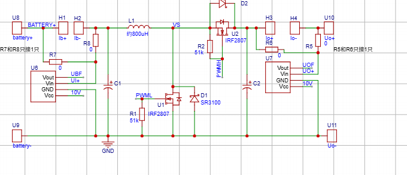
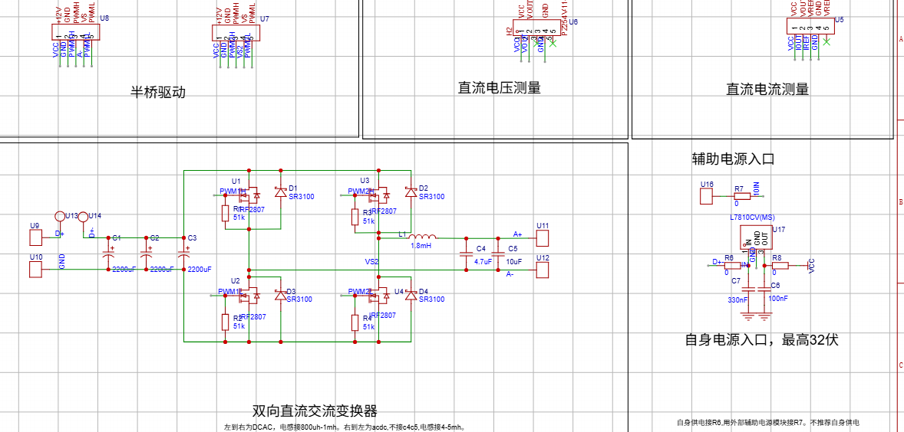
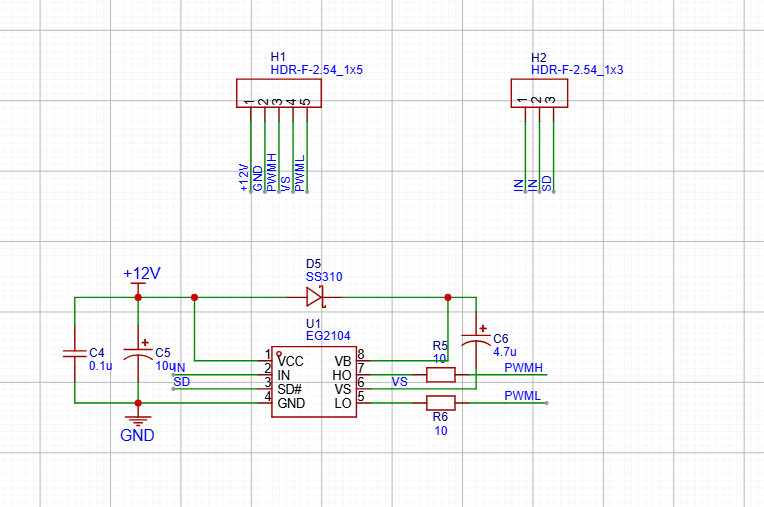
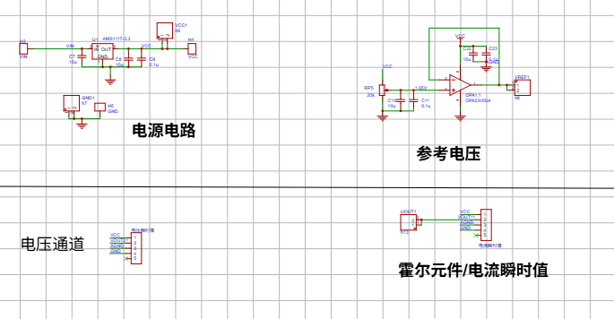
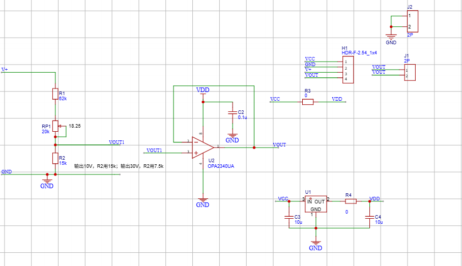
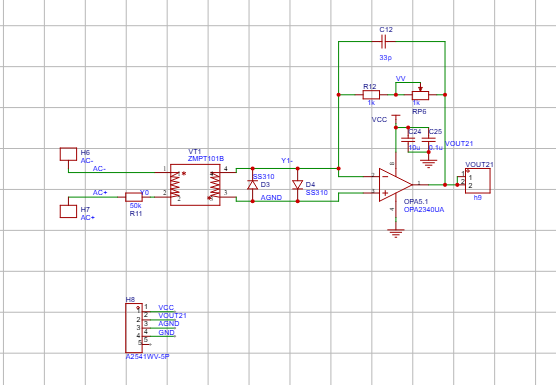
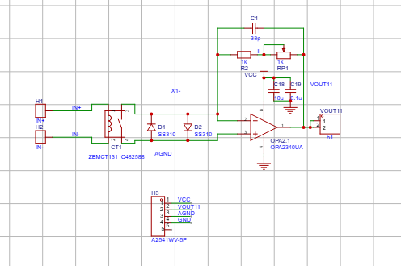
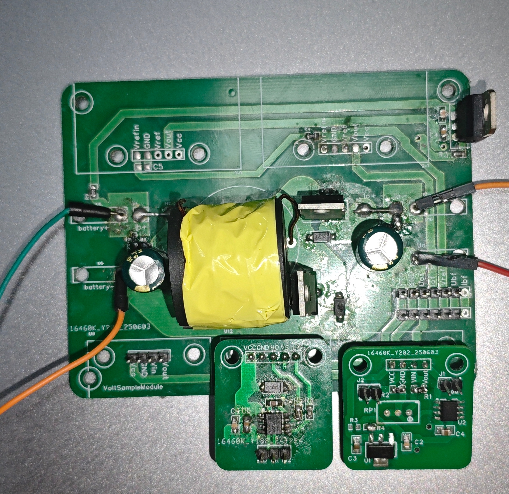

# 基于STM32G474VET6 光伏储能逆变嵌入式竞赛系统
## 一、项目简介
本项目为全国大学生嵌入式电子竞赛参赛作品，主控芯片选用STM32G474VET6，搭建一套小型光伏储能双向充放电逆变实验平台。
系统整体功率链路：光伏输入→Boost升压双向DC-DC单元→电池BMS储能单元→全桥逆变单元，最终输出9V/50Hz标准正弦交流电。
### 功能说明与项目局限
1. 未开发扰动观察法MPPT光伏最大功率跟踪算法，光伏输入仅做基础电压采集；
2. 电池管理系统仅实现低压小容量电池充放电控制，无高压储能架构；
3. 逆变输出为低压9V交流，非工业220V市电等级；
4. 人机交互仅使用OLED屏幕展示电压、电流、温度数字参数，未使用TouchGFX图形界面，无实时波形绘制功能；
5. 谐波分析、THD总谐波畸变率计算功能完全自主手写算法实现，不依赖官方CMSIS-DSP函数库。

## 二、整体硬件架构
硬件分为四大独立板块：Boost升降压功率板、全桥逆变功率板、信号采样测量板、辅助电源驱动板，全部硬件集成过压、过流、过温、短路四重硬件保护电路，通过硬件钳位、限流、熔断器实现故障快速切断，保障系统上电、带载、短路工况下安全稳定运行。

### 2.1 功率主电路原理图
#### 2.1.1 Boost双向DC-DC升压电路
Boost电路作为光伏侧升压、电池侧充放电双向变换单元，实现光伏电压抬升与电池恒流充放电控制。

#### 2.1.2 全桥逆变主功率电路
采用H型全桥拓扑，配合SPWM驱动生成正弦交流波形，输出9V/50Hz工频交流电。

#### 2.1.3 EG2104栅极驱动电路
逆变桥、Boost开关管均采用EG2104半桥驱动芯片，实现高低侧MOS管隔离驱动，提供死区时间防直通保护。

#### 2.1.4 系统辅助电源电路
为驱动芯片、采样运放、OLED屏幕、单片机、蜂鸣报警模块提供多路隔离稳定直流供电。

### 2.2 信号采样测量电路
多路差分/分压采样电路，采集光伏侧、电池侧、逆变输出侧电压、电流信号，经RC二阶滤波后送入STM32内部ADC完成模数转换。
#### 2.2.1 直流电压测量采样电路
用于光伏输入电压、电池端电压、母线直流电压采集。

#### 2.2.2 交流电压测量采样电路
逆变输出交流电压分压采样，用于闭环稳压与谐波分析采集。

#### 2.2.3 交流电流测量采样电路
采用采样电阻采集逆变输出交流电流，用于过流保护、功率计算、THD谐波分析。

## 三、硬件实物实拍展示
### 3.1 Boost升压电路板实物

### 3.2 全桥逆变电路板实物

### 3.3 采样测量信号板实物

## 四、软件整体功能设计
### 4.1 底层外设驱动
1. ADC多通道DMA同步采样，多路电压、电流、温度高速采集；
2. TIM定时器生成互补SPWM波形，带死区控制驱动全桥逆变；
3. I2C驱动0.96寸OLED屏幕，实时刷新各类运行参数；
4. GPIO故障光报警驱动，异常时LED闪烁；
5. 开启芯片硬件FPU浮点协处理器、CORDIC三角函数加速器、FMAC乘加滤波器硬件外设，加速浮点运算与波形生成。

### 4.2 自研信号处理算法
完全手写实现FFT快速傅里叶变换算法，对采集的交流电压/电流波形做频谱分解，基于各次谐波幅值自主计算THD总谐波畸变率，用于评估逆变输出波形质量.

### 4.3 故障诊断与保护逻辑
采用有限状态机管理系统运行工况，实时监测采样电压、电流数值：
- 欠压故障：母线/输出电压低于阈值，关闭PWM输出并触发报警；
- 过压故障：母线/输出电压超出阈值，关闭PWM输出并触发报警；
- 过流故障：充放电、逆变输出电流超限，硬件限流+软件关波双重保护；
- 短路故障：输出短路瞬间硬件熔断器切断功率回路，软件同步锁定故障状态。

## 五、开发环境与编译说明
1. 主控芯片：STM32G474VET6（ARM Cortex-M4内核，硬件FPU）
2. 工程配置：开启单精度浮点硬件加速，启用CPACR协处理器寄存器，初始化CORDIC、FMAC硬件数学外设；
3. 调试方式：可通过串口打印实时电参量、THD计算结果、故障状态代码。

## 六、项目适用场景
2. 电力电子、嵌入式单片机联合课程综合设计；
3. 小型储能逆变系统教学实验平台，覆盖DC-DC变换、SPWM逆变、信号采样、谐波分析、故障保护等核心知识点。
